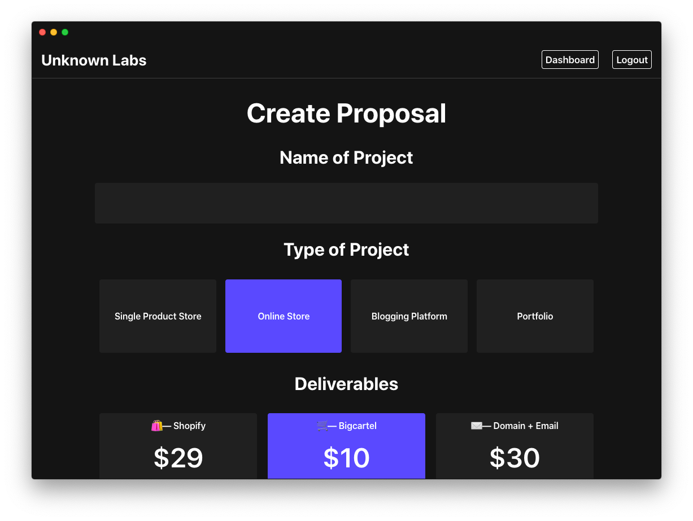

# Client

 
<a href="https://client-sandy.vercel.app">Live App</a>  📚 Manage clients, projects, documentation and more in one easy to access website For freelancers and small digital agencies.

## Motivation
Inspired by my need to start a business and have everything client related in one place for accessibility and clarity.

## Features
- Sign up for your brand
- Request a web project in a easy to use form (instead of emails cobbled together specs)
- See updates made to the project via the project detail
- Responsive design

TODO:
- Chat
- Email Notifications
- Invoicing
- Stripe & Paypal Support
- Reporting

## Tech Stack
- HTML
- CSS
- Javascript
- React
- PostgreSQL

## Installation & Development 

You'll need `client-server` to be active and running before starting this repo.

- Clone from [`https://github.com/joshuaakanetuk/client`](https://github.com/joshuaakanetuk/client-server)
- `cd` into `client`
- Run `npm i` 
- Run `npm run dev`

## Copyright
Copyright 2020, Joshua Akan-Etuk. 

 

